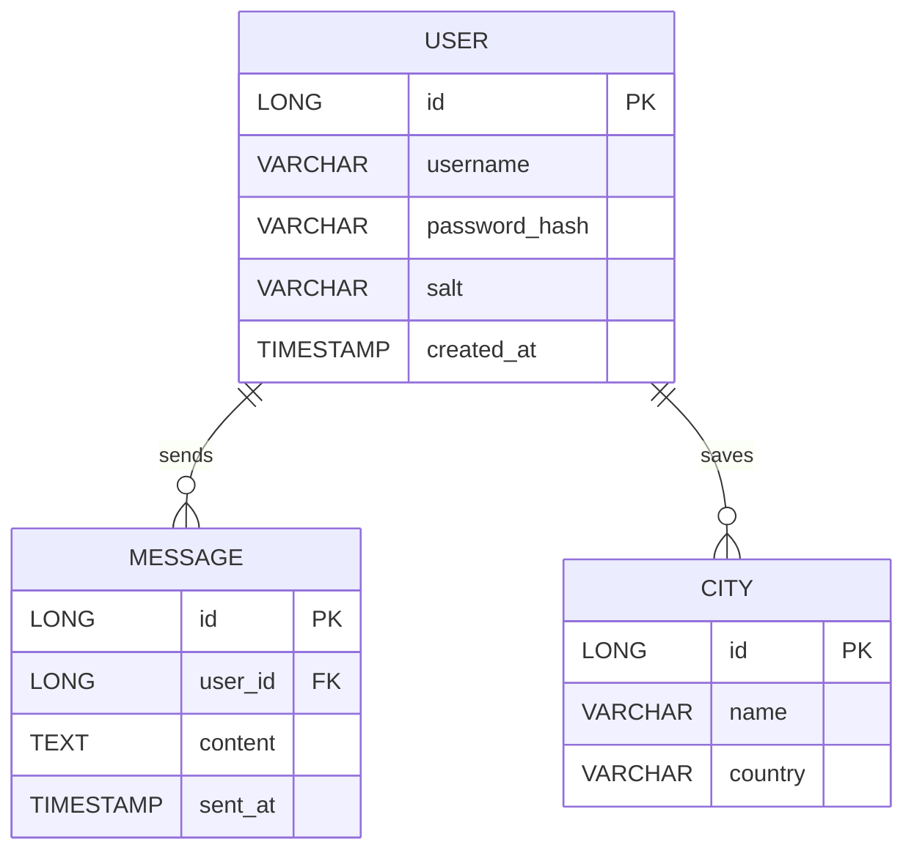

# Семестровая работа — Программирование на Java

> **Вариант:** (укажите номер варианта — 1: «Чат», 2: «Погода», либо свой вариант)  
> **Репозиторий:** добавьте ссылку/путь на ваш проект

---

## Содержимое репозитория
```
/ (корень)
├─ README.md
├─ .env.sample
├─ db/
│  ├─ init.sql
│  └─ README-db.md
├─ client/                # JavaFX клиент
├─ server/                # Сервер (если есть отдельный модуль)
└─ docs/
   └─ er_diagram.mmd
```

---

## Список участников
1. Фамилия Имя — роль (например: Frontend / UI)
2. Фамилия Имя — роль (например: Backend / DB)
3. Фамилия Имя — роль (опционально)

> Укажите контакт (email) и GitHub-аккаунт каждого участника.

---

## Выбранный вариант задания
**Вариант:** `1` (Чат) / `2` (Погода) / `Свой вариант`  
**Краткое описание функциональности:**  
Опишите основные возможности приложения (регистрация/вход, обмен сообщениями, сохранение избранного города и т.п.).

---

## Быстрый старт (Run / Запуск)
1. Склонируйте репозиторий:
   ```bash
   git clone <репозиторий>
   cd <папка проекта>
   ```
2. Скопируйте шаблон `.env.sample` в `.env` и заполните параметры:
   ```bash
   cp .env.sample .env
   ```
3. Запустите скрипты создания БД (пример для H2):
   ```bash
   # пример для H2 (подставьте ваши значения)
   java -cp "<путь_до_h2.jar>" \
     org.h2.tools.RunScript \
     -url "jdbc:h2:<Путь_до_файла_бд>" \
     -user <пользователь> \
     -password "<пароль>" \
     -script "db/init.sql"
   ```
4. Запустите сервер:
   ```bash
   # например через Maven
   mvn -f server/pom.xml spring-boot:run
   ```
5. Запустите клиент (JavaFX):
   ```bash
   mvn -f client/pom.xml javafx:run
   ```

---

## Структура проекта и важные файлы
- `client/` — модуль с JavaFX приложением.
- `server/` — серверная часть (сокеты, REST, работа с БД).
- `db/init.sql` — скрипты создания таблиц и начальных данных.
- `.env` или `application.properties` — конфигурация сервера/клиента (учётные данные БД, API-ключи и т.д.).
- `logs/` — (игнорируется в Git) — папка с логами приложения.
- `docs/er_diagram.mmd` — ER-диаграмма в формате mermaid.

---

## Настройка окружения
Пример переменных в `.env` (см. `.env.sample`):
```
# База данных
DB_URL=jdbc:h2:./data/chatdb
DB_USER=sa
DB_PASSWORD=

# Сервер
SERVER_PORT=8080
# (для варианта Погода) OpenWeatherMap API ключ
OWM_API_KEY=ВАШ_API_КЛЮЧ

# Логирование
LOG_PATH=logs/app.log
```

---

## Логирование
- Используем `slf4j` + `logback`.
- Конфигурация logback должна:
  - Логировать действия пользователей в **консоль**.
  - Логи с уровня `ERROR` и исключения — в **файл** (пусть файл указывается в `LOG_PATH`).
- Пример расположения конфигурации: `server/src/main/resources/logback.xml`.

---

## Безопасность паролей
- Пароли хранятся в хешированном виде. Рекомендуемые варианты:
  - `BCrypt` (`org.springframework.security.crypto.bcrypt.BCryptPasswordEncoder`), или
  - `SHA-256` с солью (не рекомендуется вместо BCrypt, но допустимо в образовательных целях).
- В базе хранить: `username`, `password_hash`, `salt` (если используется SHA-256), `created_at`.

---

## Обмен сообщениями / Формат данных
- Обмен осуществляется в формате JSON.
- Примеры JSON-сообщений:
  ```json
  // регистрация
  { "type": "register", "username": "ivan", "password": "..." }

  // сообщение в чате
  { "type": "message", "from": "ivan", "text": "Привет!" }
  ```

---

## Кастомные исключения
Создавайте собственные классы исключений для логических ошибок:
- `UserNotFoundException`
- `AuthenticationException`
- `DatabaseException`
- `CityNotFoundException` (для варианта Погода)
- и т.д.

---

## ER-диаграмма (Mermaid)
Сохраните диаграмму в `docs/er_diagram.mmd` и вставьте сюда минимальную версию.


---

## Скрипты создания БД
Файл `db/init.sql` должен содержать CREATE TABLE и начальные значения. Пример:
```sql
CREATE TABLE IF NOT EXISTS users (
  id BIGINT AUTO_INCREMENT PRIMARY KEY,
  username VARCHAR(255) NOT NULL UNIQUE,
  password_hash VARCHAR(255) NOT NULL,
  salt VARCHAR(255),
  created_at TIMESTAMP DEFAULT CURRENT_TIMESTAMP
);

CREATE TABLE IF NOT EXISTS messages (
  id BIGINT AUTO_INCREMENT PRIMARY KEY,
  user_id BIGINT NOT NULL,
  content TEXT,
  sent_at TIMESTAMP DEFAULT CURRENT_TIMESTAMP,
  FOREIGN KEY (user_id) REFERENCES users(id)
);
```

---

## Критерии оценки (коротко)
- Соответствие требованиям: регистрация/вход, JavaFX, БД, логирование, сетевые соединения — до 7 баллов.
- Сценарии тестирования, скрипты БД — до 3 баллов.
- UI (удобство/красота) — до 2 баллов.
- Логирование (консоль/файл) — до 2 баллов.
- Чистота кода, архитектура, обработка исключений — до 5 баллов.
- Командная работа — до 1 балла.

---

## Рекомендации по оформлению репозитория
- Добавьте `.gitignore` (игнорировать `logs/`, `.env`, `target/`, `*.iml` и т.п.).
- Документируйте архитектуру и распределение задач в `docs/`.
- Добавьте `README-db.md` в папку `db` с инструкцией по инициализации БД.

---

## Контакты преподавателя / дополнительные замечания
- Укажите ФИО преподавателя и дедлайн (если нужно).
- Приложите скриншоты интерфейса в `docs/screenshots/` (по желанию).

---

> При возникновении вопросов — свяжитесь с командой через issues в репозитории.
